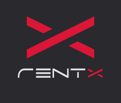

<h1 align="center">
    
</h1>

<p align="center">
  <a href="#technologies">Technologies</a>&nbsp;&nbsp;&nbsp;|&nbsp;&nbsp;&nbsp;
  <a href="#getting-started">Getting started</a>&nbsp;&nbsp;&nbsp;|&nbsp;&nbsp;&nbsp;
  <a href="#project">Project</a>&nbsp;&nbsp;&nbsp;|&nbsp;&nbsp;&nbsp;
  <a href="#application">Application</a>
</p>

<br>

<p align="center">
  
</p>

---

## Technologies

This project is part of the RocketSeat's ignite course and shows using AsyncStorage to store data, Yup for form validation, victory native to generate charts and the social login with google and apple.

This project was developed using the following technologies:

- [React Native](https://reactnative.dev/)
- [Expo](https://expo.io/)
- [TypeScript](https://www.typescriptlang.org/)

## Getting started

Clone the project and access the folder

```bash
$ git clone https://github.com/HelvioFilho/rentx.git && cd rentx
```

Follow the steps below
```bash
# Install the dependencies
$ yarn install

# Start the project
$ expo start
```

## Project

Application to schedule a car rental from a dealership.


## Application

Use the link below to try the app at the [expo](https://expo.io/)

[](https://expo.dev/@loihve/rentx)